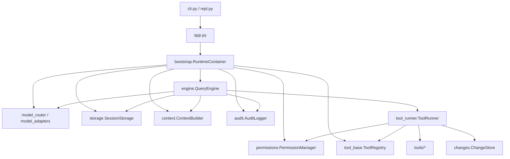

# miniAgent 架构说明

`miniAgent` 是一个学习型 coding agent runtime。核心目标不是追求模型效果，而是把 agent 的执行边界、上下文、工具、安全、存储和可观测性拆清楚。

## 核心原则

```text
模型只能提出行动，runtime 才能决定是否行动。
```

模型返回的是消息和工具调用意图。真正的文件读取、编辑、shell、记忆、插件和审计都由本地 runtime 统一执行，并经过权限、安全和记录层。

## 模块关系



## 关键路径

1. CLI 或 REPL 创建 `MiniAgentApplication`。
2. `RuntimeContainer` 装配模型、工具注册表、存储、权限、上下文和审计。
3. `QueryEngine.submit()` 把用户输入加入消息历史。
4. `ContextBuilder` 根据预算生成系统提示、工具 schema 和裁剪后的历史。
5. 模型返回 assistant message，可能包含 `tool_use`。
6. `ToolRunner` 按并发安全性分组执行工具，并先调用 `PermissionManager`。
7. 工具结果以 `tool_result` 消息回灌给模型。
8. session snapshot、事件日志和 audit log 被保存。

## 目录职责

| 路径 | 职责 |
|---|---|
| `miniagent/engine.py` | ReAct 主循环、工具结果回灌、最大轮次、错误恢复 |
| `miniagent/tool_runner.py` | 工具调用解析、并发/串行分批、权限检查、结果包装 |
| `miniagent/tool_base.py` | 工具协议、工具上下文、工具注册表 |
| `miniagent/tools/` | 内置工具，包括文件、shell、记忆、计划、代码理解 |
| `miniagent/security/` | 路径、敏感文件、shell 风险和权限规则 |
| `miniagent/context.py` | 系统提示、工具 schema、记忆、代码上下文和历史裁剪 |
| `miniagent/context_budget.py` | token 预算分区 |
| `miniagent/storage.py` / `miniagent/event_log.py` | session snapshot 和事件溯源 |
| `miniagent/audit.py` / `miniagent/audit_report.py` | 审计日志与 session 复盘报告 |
| `miniagent/memory.py` | user/project/session 三层记忆和可解释召回 |
| `miniagent/model_router.py` / `miniagent/model_adapters.py` | provider 路由和模型适配 |
| `evals/` | deterministic benchmark 和报告生成 |
| `demos/` | 可重放真实项目 Demo |

## 安全边界

- 文件路径必须留在工作区内，敏感文件默认拒绝。
- 覆盖已有文件前必须完整读取，且写入前检查 `mtime_ns` 和 `size`。
- `shell` 工具会拦截危险命令，并在权限层区分只读、测试、写入、网络等风险。
- 非交互 `--print` 模式下，需要确认的操作默认拒绝。
- 工具结果被标记为 untrusted，再回灌给模型。

## 存储和可观测性

session 使用两层记录：

- `sessions/*.json`：当前可恢复 snapshot。
- `events/*.jsonl`：事件溯源日志，可重建 session。

审计使用 `audit.jsonl`，记录请求、模型请求、工具调用、权限决策、工具结果、文件变更、错误和保存事件。`miniagent audit show <session_id>` 会聚合 session、storage event 和 audit event，输出复盘报告。

## 扩展点

- 新工具实现 `BaseTool` 并注册到 `ToolRegistry`。
- 新模型 provider 实现 `ModelClient`，再接入 `model_router`。
- 插件通过 `.miniagent/plugins/<name>/plugin.json` 和 `register(registry)` 扩展工具。
- 代码理解目前用 Python AST 和轻量文本扫描，后续可以在 `code_index.py` 替换为 tree-sitter。
